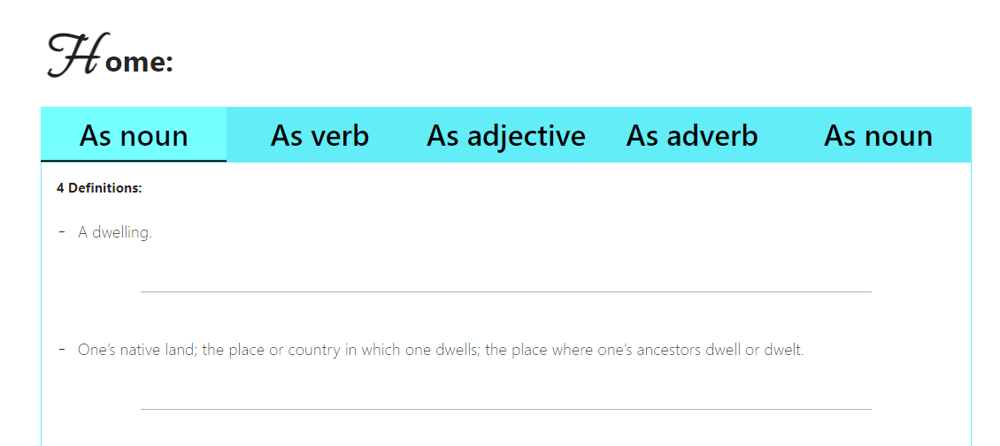
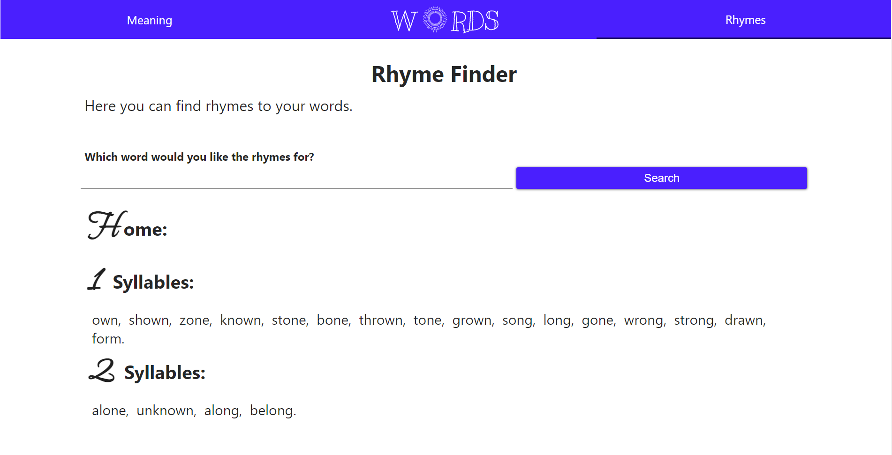

# Word Analyzer

[Go to app](https://cometbroom.github.io/Dictionary_APP/#home)

This is a web app that allows you to analyze words. You can look up definitions and their usage, as well as rhyming words.


## Folder Structure

```
.
├── public/
│   └── ...Application assets and styling
├── readme-assets/
│   └── ...Github assets
├── src/
│   ├── components/
│   │   └── ...Modules that modify elements programatically
│   ├── fetchers/
│   │   └── ...Modules for fetching data
│   ├── lib/
│   │   └── ...Main functionality tooling such as logger, router etc...
│   ├── pages/
│   │   ├── ...Pages controller and functionality module
│   │   └── ...Routes array responsible for pages entry
│   ├── tools/
│   │   └── ...Side functionality tooling such as type checkers
│   └── views/
│       └── ...Pages rendering and event listening module
└── ...App entry, constants and data (on-memory)
```

## Design

I've made this app with HTML/CSS and vanilla javascript. It is SPA done with javascript. No database as it's using an external API for finding word meanings.

## Directions

You have 2 tabs, one for Meaning (of words) and the other for Rhymes. On every tab you have an input for searching a word. You can enter any word and analyze them:



As you can see you also have tabs which analyze the word in its different meaning, As noun, very and etc...

While having the word analyzer open, you can head to Rhymes section to find Rhymes for the same word:



### I hope you find this useful

## Requirements

- [x] Single page application.
- [x] Interact with an API for data.
- [x] Loading screen.
- [x] Error handling.
- [x] Data fetched based on interaction.
